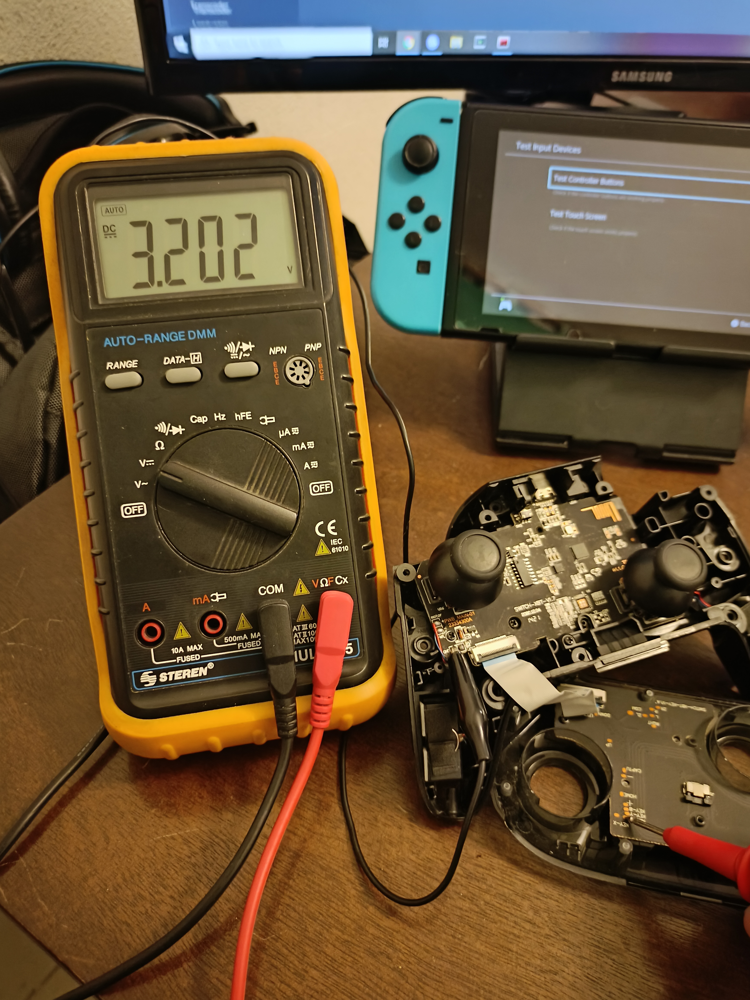
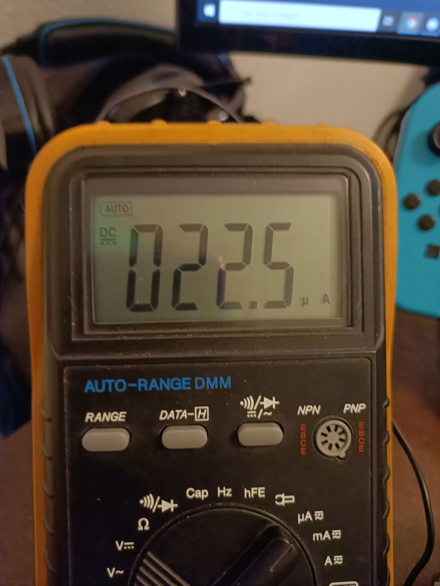

# Initial testing
The switch pro controller usually has 3.2V~ when the button is idle.
pressing or shorting the pad to ground consumes 22.5uA so it can easily be drive directly from a microcontroller or arduino board.

