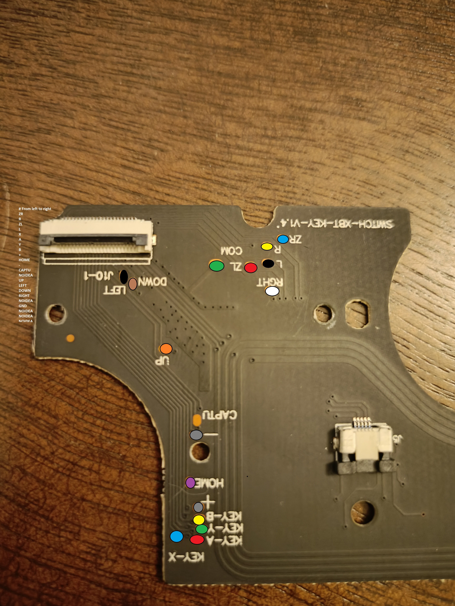
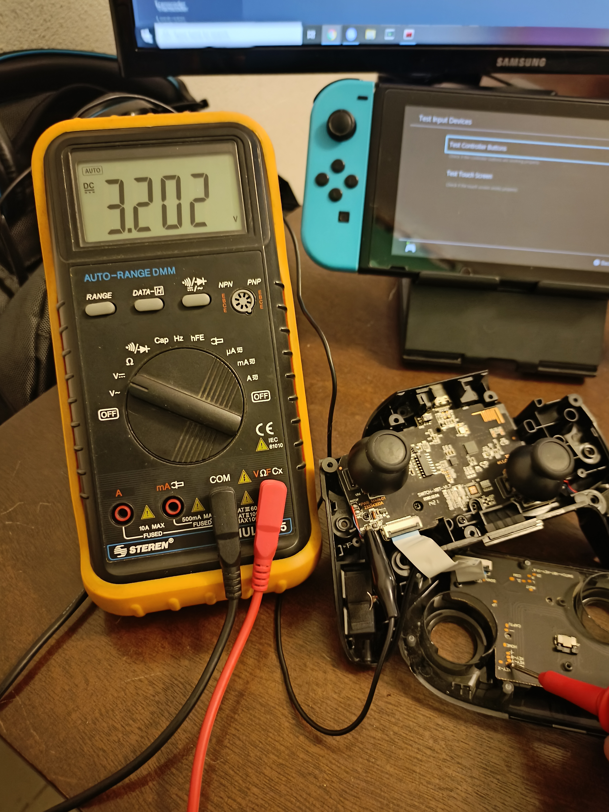
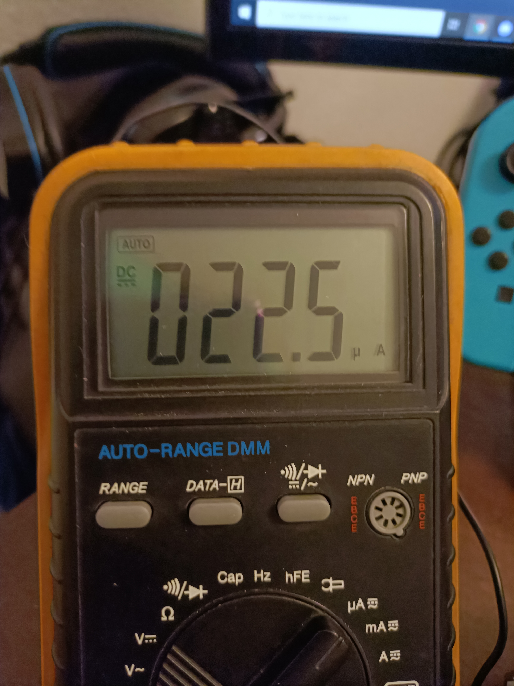
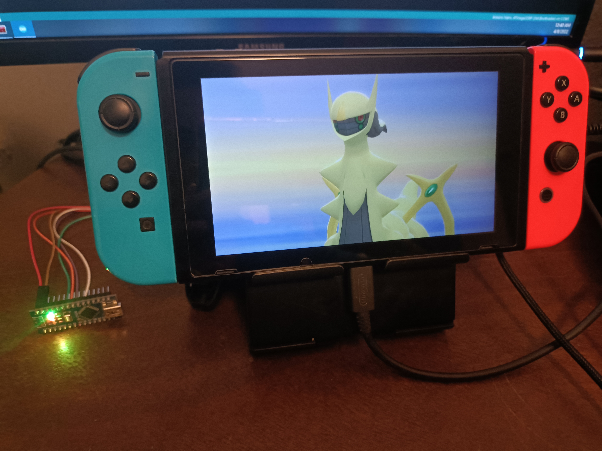

# Initial testing
The switch pro controller usually has 3.2V~ when the button is idle.
Pressing or shorting the pad to ground consumes 22.5uA so it can easily be drive directly from a microcontroller or arduino board.

# Conclusion
Just buy an arduino leonardo or ATmega32U4 compatible board to avoid the hassle of soldering cables to the pro controller board.
The advantages of using any arduino and the pro controller is that you can have both portable and charged, or you can just move around with the switch ocasionally looking if you got a shiny or not.

